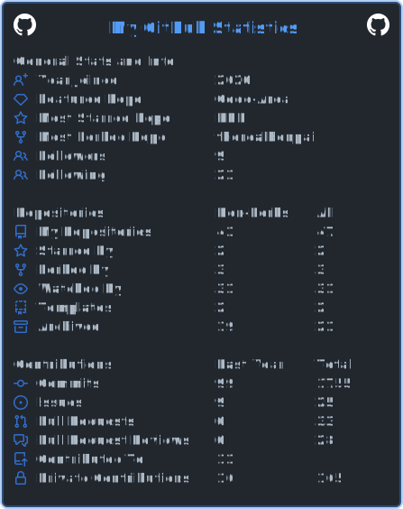

  <h1>About Me</h1>

  <h2>My Info</h2>
  

    Hello! My name is Benjamin, but you may know me better as benshawmean or Benpai.
    I am a full-stack developer who owns and manage a few organizations including <a href="https://github.com/femdevs">@FemDevs</a>.
    I specialize in JavaScript and Python development but also have experience in Java and bash as well as a beginner-level understanding of C, C++, C#, VBScript, and JQuery.
    I mainly use the Node ecosystem for development with a high-level understanding of Express.js, Discord.js, and Sentry as well as an intermediate understanding of Pug.js.
    You can contact me at <a href="mailto:benpai@thefemdevs.com">my email address</a>.
  

  

  <h2>Stats</h2>
    
  

  <h2>Moving accounts</h2>
  

    Due to issues regarding GitHub and it's uptime, I have decided to start migrating to GitLab. Most of my more recent repositories are now over there. The only thing I will keep here are my secutity policy (as I personally love GitHub's UI for making security reports), and really old repos.
    Please visit at <a target="_blank" href="https://gitlab.com/benshawmean">https://gitlab.com/benshawmean</a> to see the updated repositories
  

