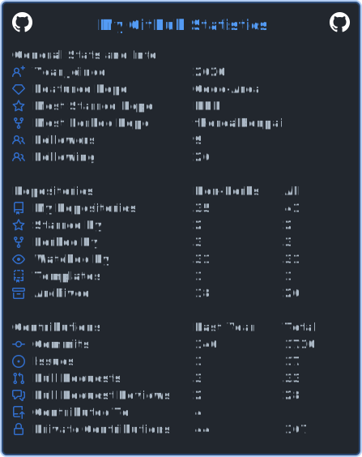

  <h1>About Me</h1>

  <h2>My Info</h2>
  
Hello! My name is Benjamin, but I also go by Benpai or Sparty182020. I am a full-stack developer who owns and manage a few organizations including <a href="https://github.com/femdevs">@FemDevs</a>. I also work for <a href="https://github.com/Sanrio-Cottage-Developers">@Sanrio Cottage Developers</a> and <a href="https://github.com/Development-as-a-Dependency">@Development as a Dependency</a>. I specialize in JavaScript and Python development but also have experience in Java and bash as well as a beginner-level understanding of C, C++, C#, VBScript, and JQuery. I mainly use the Node ecosystem for development with a high-level understanding of Express.js, Disacord.js, and Sentry as well as an intermediate understanding of Pug.js. You can contact me at <a href="mailto:contact@sparty18.com">my email address</a>.

  

  <h2>Stats</h2>
  

    
    
  

    

